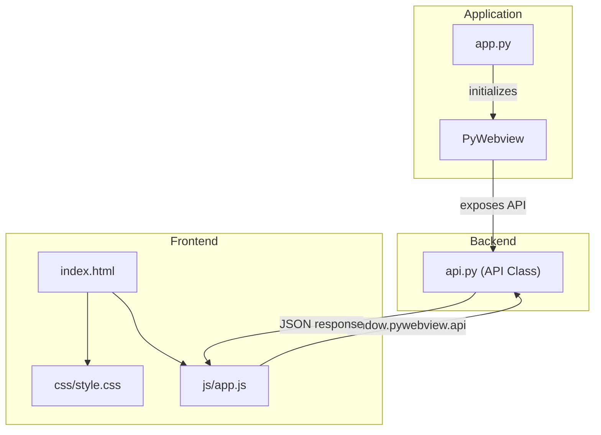

# PyWebNative

A lightweight template for building desktop applications using Python backend and web frontend technologies (HTML, CSS, JavaScript) with PyWebview.

## Overview

This template provides the essential structure for creating desktop applications that leverage:

- **Python Backend**: For business logic, data processing, and system access
- **Web Frontend**: Modern HTML, CSS, and JavaScript for the user interface
- **PyWebview**: The bridge that connects the two worlds

## Features

- Clean, modular project structure
- Python API class for backend functionality
- Modern, responsive UI with CSS
- JavaScript frontend with API communication examples
- Ready-to-use examples of common operations:
  - System information retrieval
  - Data echo (Python ↔ JavaScript communication)
  - Data saving functionality

## Project Structure

```
PyWebNative/
├── app.py              # Main application entry point
├── api.py              # Python backend API class
├── requirements.txt    # Python dependencies
├── frontend/           # Frontend web assets
│   ├── index.html      # Main HTML file
│   ├── css/
│   │   └── style.css   # CSS styles
│   └── js/
│       └── app.js      # Frontend JavaScript
└── README.md           # Documentation
```

## Architecture



User Workflow:
1. Run `python app.py` to launch the desktop app
2. Backend (`api.py`) methods exposed via PyWebview
3. Frontend loads `index.html`, `style.css`, and `app.js`
4. JS calls backend methods and updates the UI based on JSON responses

## Getting Started

### Prerequisites

- Python 3.6 or higher
- pip (Python package manager)

### Installation

1. Clone or download this template
2. Install the required dependencies:

```bash
pip install -r requirements.txt
```

### Running the Application

Simply run the main application file:

```bash
python app.py
```

## Customizing the Template

### Backend (Python)

Edit the `api.py` file to add your own Python methods. Any method in the `API` class will be accessible from JavaScript.

Example:

```python
def my_custom_method(self, param1, param2):
    # Your custom logic here
    return {"result": "Some result", "params": [param1, param2]}
```

### Frontend

- **HTML**: Edit `frontend/index.html` to create your UI structure
- **CSS**: Modify `frontend/css/style.css` for styling
- **JavaScript**: Update `frontend/js/app.js` to add frontend logic

To call Python methods from JavaScript:

```javascript
// Call a Python method and get the result
const result = await window.pywebview.api.my_custom_method("value1", "value2");
console.log(result);
```

## Building for Distribution

To create standalone executables, you can use PyInstaller:

```bash
pip install pyinstaller
pyinstaller --add-data "frontend;frontend" --windowed app.py
```

## License

This template is provided as open source. Feel free to use it for any project.

## Resources

- [PyWebview Documentation](https://pywebview.flowrl.com/guide)
- [HTML/CSS/JavaScript MDN Web Docs](https://developer.mozilla.org/)
